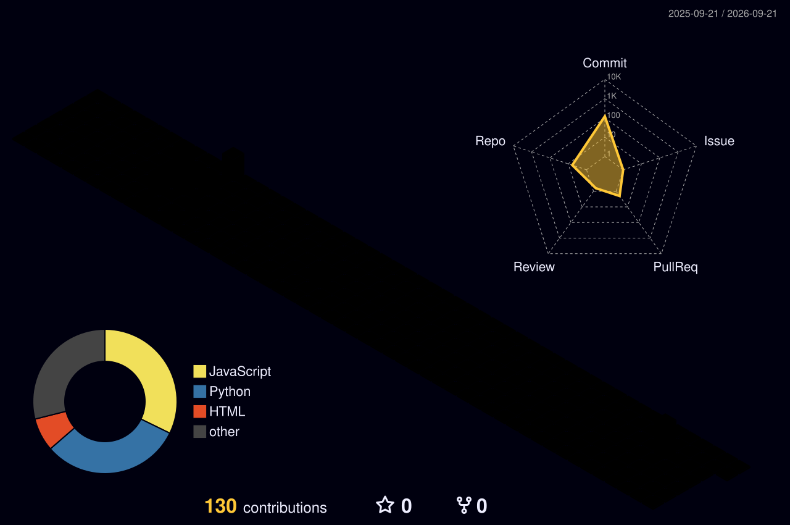

<h1 align="center">Hi 👋, I'm Arvind D</h1>

<h3 align="center">
Decision & Computing Science Student • Data Science • ML • Deep Learning • GIS
</h3>

  

---

## 👨‍💻 About Me

I'm a Decision and Computing Science student interested in
Data Science, Machine Learning, Deep Learning, GIS and Computer Vision.

I enjoy working with data, building machine learning and deep learning
models, and developing practical applications using Python and SQL.

Currently exploring Machine Learning, Deep Learning, Computer Vision and
Geographic Information Systems through academic and personal projects.

---

## 🛠️ Tech Stack

### 💻 Programming & Data

  

### 🤖 Machine Learning & Deep Learning

  

  Pandas • NumPy • Scikit-learn • TensorFlow • PyTorch

### 👁️ Computer Vision

  

  YOLOv8 • ByteTrack • InsightFace • FAISS • OpenCV

### 🗺️ GIS

  ArcGIS Pro • ArcGIS Online • Geographic Information Systems (GIS)

### 📊 Data Visualization

  Power BI • Matplotlib

---

---

## 🧊 GitHub 3D Contributions

  

## 🐍 Contribution Graph

  

---

## 🌐 Connect With Me

  
  &nbsp;&nbsp;&nbsp;
  

